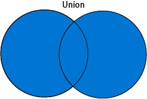
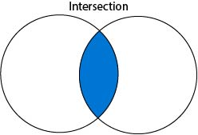

# A Tutorial in Set Theory and Cartesian Products for Database Systems

## Table of Contents
1. Introduction
2. Tuples and Sets
3. Set Union
4. Set Intersects
5. Cartesian Products
6. Joins/Queries  
Appendix A. Solutions to Example Questions

## 1. Introduction

Hello and welcome to this tutorial on set theory and cartesian products from a relational database perspective! This short course will introduce you to the mathematical theory behind relational databases by covering topics in basic set theory. To complete this tutorial you do not need to have seen set theory but you should have a basic understanding of the SQL language. Should you have a firm grasp of elementary set theory then you should skip ahead right to section 6, which pertains to SQL. If not, do not worry! We will cover each basic set operations and definitions complete with workable examples. 

The purpose of this lesson is to provide insight into what’s happening behind the scenes in relational databases. We specifically provide examples of SQL joining queries at the end of this tutorial for a practical look at how set theory is used. So dive in, take your time, work through the examples, and enjoy learning about the theory behind relational databases.

## 2. Tuples and Sets

Alright, let us begin. Before we talk about sets we should define **tuples** because the two are easy to mistake for each other.. Let’s start with a definition:

Definition: **Tuples** are a finite ordered list of elements.

Now for an example. Say we have the names and ages for everyone that lives in a city, and let’s also say that we want to organize people based on their age and group their names together. Depending on which city we have data for, we may have a very large number of data points. It is useful to organize this data using a **data structure**. A very basic data structure is a tuple. 

For our example, if we had a tuple of all the ages from people in our city it would look like this:

(16, 67, 51, 56, 19, 56, 51, 19, 16, 19, ...)	

Simply put, it is just a list of all the ages separated by commas inside of parentheses. Parentheses are the standard notation when constructing a tuple. Note that a tuple must be **ordered**. Although our example above does not appear to have any discernible order, the order is actually the order in which the data was received-- which is still an acceptable order! 

Elements in a tuple can be anything you need them to be; they do not have to be numerical values. For example, strings can be elements in a tuple. In the context of our example it could be the first names of the people we have ages for.

(Bianca, Harold, Karl, Tommy, Lizzie, Ryan, Robyn, Nick, Harold, Izabelle, ...)

So, to group the names by their equivalent ages all we have to do is look through the raw data and match the ages with their corresponding string. For example, say we had this data:

|Name      |Age |
|----------|----|
| Bianca   | 16 |
| Harold   | 67 |
| Karl     | 51 |
| Tommy    | 56 |
| Lizzie   | 19 |
| Ryan     | 56 |
| Robyn    | 51 |
| Nick     | 19 |
| Harold   | 16 |
| Izabelle | 19 |

Then tuples of people with equivalent ages would look like this: 

	(Bianca, Harold)
	(Harold)
	(Karl, Robyn)
	(Tommy, Ryan)
	(Nick, Izabelle, Lizzie)

Notice how each of the inner tuples represents a single person and the outer tuple represents the population of the city as a collection of people.

Now that we’ve defined tuples, we can now introduce **sets**. Sets are often confused with tuples because their differences are minute and hard to catch. Let’s start with a formal definition:

Definition: A **set** is a collection of distinct objects

When we say collection instead of list it’s because we’re saying that a set is **unordered**, unlike tuples. Sets have a different notation than tuples and only contain one of each **distinct** element (tuples contain repeats of identical values but sets do not). Although both tuples and sets can contain elements of different types, sets generally do not because it doesn’t make much sense to perform certain set operations on sets with elements of different types. 

Looking back at our city example we can examine the differences between sets and tuples. If we are to put the ages into a set it would look like:

	{16, 67, 51, 56, 19, …}

Recall that we had repeats when we displayed the data as a tuple and also note the use of curly braces. In a set, each item only appears once regardless of how many duplicates there are. This is what is meant by describing it as a collection of distinct objects. The curly braces are always used to denote a set, and parentheses define a tuple.

Depending on the data you’re trying to display, it may be more helpful to use a tuple or a set. If you wanted to display all the ages present in the city and find generation gaps you should use a set. But, if you wanted to display the relative frequencies of how many people are the same age, you should use tuples. 

Sets are much more powerful because you can use them for set operations. Set operations lay the foundation for relational databases and how tables can be manipulated to retrieve specific data. We will cover set unions and intersections in the next two sections. These topics will be followed by cartesian products and after that we will discuss examples in relational databases using SQL. 

###Let’s try out what you’ve learned so far. Given the following table, answer the questions below. At the end of this tutorial in appendix A, you may find the solutions to these questions under Section 1.

|Movie           |Running Time (minutes)|Director         |
|----------------|----------------------|-----------------|
|The Delivery Man|105                   |Ken Scott        |
|The Internship  |119                   |Shawn Levy       |
|Wedding Crashers|119                   |David Dobkin     |
|The Watch       |102                   |Akiva Schaffer   |
|Couples Retreat |113                   |Peter Billingsley|
|The Dilemma     |111                   |Ron Howard       |

1. Write a tuple for the movie titles.
2. Write a tuple and a set for the running times. Notice any differences between the two?
3. Write a tuple of tuples for running times and directors.

For more information on Tuples and Sets try the following links:  
* For a live example of Tuples in Python, click [here](https://www.w3schools.com/python/python_tuples.asp)  
* For a less interactive example of Tuples in Python, click [here](http://openbookproject.net/thinkcs/python/english3e/tuples.html)  
* For a more formal definition of Sets, click [here](http://mathworld.wolfram.com/Set.html)  
* For an in depth yet informal introduction to Sets, click [here](https://www.mathsisfun.com/sets/sets-introduction.html)  

## 3. Set Unions

Before, we mentioned that sets are more powerful than tuples, but why is that? Sets are more powerful than tuples because of their properties. Allowing a set to be unordered and only contain distinct objects lets us define a series of operations with which to compare and manipulate sets. One such operation is the **union** of two sets. 

Definition: **Set Union** results in a single set containing the distinct elements of two or more other sets.

What does this look like? Let’s see a numerical example first.

Imagine we have 3 sets A, B, and C given below. 

A = {1, 2, 3, 4}  		
B = {3, 4, 5, 6}  		C = {5, 6, 7, 8, 9}  

After applying the set union operation (denoted by the “cup” symbol) we receive the following results:

A ⋃ B = {1, 2, 3, 4, 5, 6}  	
A ⋃ C = {1, 2, 3, 4, 5, 6, 7, 8, 9}	 
B ⋃ C = {3, 4, 5, 6, 7, 8, 9}  

Notice that there are no repeats and the union result contains each element from both sets. The general expression can also be shown graphically with a Venn Diagram:



Imagine that each circle is a separate set. Both circles are highlighted in blue to indicate that all elements are contained in the union. 

You may be starting to see how these set operations form the groundwork for things like SQL queries. A set union looks similar to joining tables together, doesn’t it?

###Let’s try some examples. Given the sets below, answer the following questions. See the solutions for Section 3 in appendix A at the end of the tutorial.

D = {22, 34, 28, 7}  		E = {56, 79, 403, 2}   		F = {44, 23, 84}  

1. D ⋃ E  
2. E ⋃ F  
3. D ⋃ F  
4. D ⋃ E ⋃ F  

For more information on set intersections please follow the links below:  

For an in depth look at set intersection with a descriptive venn diagram example, click [here](https://www.basic-mathematics.com/union-of-sets.html)

## 4. Set Intersects

If a set union looks like joining tables, then a set **intersection** should remind you of reducing redundancy between tables. Let’s define this new set operation:

Definition: **Set Intersection** results in a set of elements formed of elements that two separate sets have in common.

Set intersection allows us to examine shared elements between two sets (looking for keys in tables? Use an intersection!). Let’s see what they look like with set notation. Again, imagine we have sets A, B, and C:

A = {1, 2, 3, 4}  			 B = {3, 4, 5, 6}  		 C = {5, 6, 7, 8, 9}   

Then their intersections are as follows (set intersection is denoted by the “cap” symbol): 

A ∩ B = {3, 4} = B ∩ A  
B ∩ C = {5, 6}  
A ∩ C = { } or ∅   
A ∩ A = {1, 2, 3, 4} = A  

Notice there are no values shared between sets A and C. Formally, we would say that there are no elements that intersect A and C. The intersection of A and C is an **empty set**. In set theory, the empty set is still considered a set, it just doesn’t contain any elements. We can think of empty set as analogous to zero. Just remember that even if no elements intersect two sets, the intersection still returns the empty set. Also notice that the intersection of a set and itself is the original set. This is because a set obviously shares all of its elements with itself.

Here’s an example of set intersection depicted graphically with a Venn Diagram:



The center of the circles in a venn diagram shows which elements are shared by both sets. This is the definition of set intersection. 

###Let’s try some examples to check your understanding. Given the sets below answer the following questions. See the solutions at the end of the tutorial in appendix A under Section 4.

D = {11, 22, 33, 44}  		E = {22, 44, 66}  		F = {11, 33, 55}  

1. D ∩ E  
2. D ∩ F  
3. E ∩ F  

For more information on set intersections please try the following links below:  

For an in depth look at set intersections with descriptive venn diagram examples, click [here](https://www.basic-mathematics.com/intersection-of-sets.html)
 
## 5. Cartesian Products

Now that we’ve seen both union and intersection operations, it’s time to take a look at the **Cartesian Product**. Like the other set operations, the Cartesian product is applied to two sets together. The Cartesian product also returns a set like the other operations we’ve seen, but this time the set returned is a set of tuples. Specifically, if we have two sets, A and B, and their elements are a and b where a ∊ A and b ∊ B, then the product of A x B = {(a1, b1), (a1, b2), …, (a2, b1), (a2, b2), …}. Each element of A is matched with every element of B, put in a tuple, then placed in the resultant set. Let’s look at some examples. Imagine we have sets A and B:

A = {1, 2}  		 B = {3, 4, 5, 6}  

Then find their Cartesian products:  

A x B = {(1, 3), (1, 4), (1, 5), (1, 6), (2, 3), (2, 4), (2, 5), (2, 6)}  
B x A = {(3, 1), (3, 2), (4, 1), (4, 2), (5, 1), (5, 2), (6, 1), (6, 2)}

Note that this set operation is not commutative even though the sets A and B remain the same before each Cartesian product. The order of the initial sets affects the outcome of the product. Now another example, imagine we have sets C and D:

C = {“cat”, “dog”, “fish”}  		 D = {1, 2, 3}  

Then C “cross” D equals:

C x D = {(“cat”, 1), (“cat”, 2), (“cat”, 3), (“dog”, 1), (“dog”, 2), (“dog”, 3), (“fish”, 1), (“fish”, 2), (“fish”, 3)}

You can see that it doesn’t matter what type the elements actually are, the operation remains the same.  
###Let’s try some examples. Given the following sets below, answer the following questions. See the solutions for Section 5 at the end of the tutorial in appendix A.

E = {“ball”, “bat”, “hoop”, “sneakers”}  		F = {1, 2, 3}  		G = {4, 5, 6}  

1. E x F
2. E x G
3. F x G
4. G x F

This set operation lays the basis for join queries. It is quite useful for placing table columns adjacent to each other. Follow the links below for more information on Cartesian products:  

For more examples of Cartesian products, click [here](http://www.ask-math.com/cartesian-product-of-sets.html)
## 6. Joins/Queries 

Now that we’ve seen various set operations and covered basic data structures sets and tuples, it’s time to see the applications to the relational database world. For this tutorial we will be using  the SQL language to explain this concept.

SQL, or Structured Query Language, is a **procedural** language intended for use in database systems. Within this language there are built-in functions used to generate Cartesian products of sets stored in tables. The generic term for this function is a **join**. Within a table, each tuple (or row) is treated as an element within that table’s set. So when a table is joined with another table, what’s actually occurring is the Cartesian product is taken of each row from each table to produce a new table.

With the two following tables, we can take the cartesian product of the rows of the tables by using a simple JOIN statement in SQL: 

``` SELECT * FROM Table1 JOIN Table2; ```
 
 Table1
 
| ID | Student_Name |
|----|--------------|
| 3  | Greg         |
| 6  | Tom          |
| 1  | Susan        |
| 4  | Steve        |

Table2

| Student_ID | Grade |
|------------|-------|
| 3          | B     |
| 1          | A     |
| 4          | C     |

This would return every possible pairing of a row from Table1 with a row from Table2, as in the result table below:

Result

| ID | Student_Name | Student_ID | Grade |
|----|--------------|------------|-------|
| 3  | Greg         | 3          | B     |
| 3  | Greg         | 1          | A     |
| 3  | Greg         | 4          | C     |
| 6  | Tom          | 3          | B     |
| 6  | Tom          | 1          | A     |
| 6  | Tom          | 4          | C     |
| 1  | Susan        | 3          | B     |
| 1  | Susan        | 1          | A     |
| 1  | Susan        | 4          | C     |
| 4  | Steve        | 3          | B     |
| 4  | Steve        | 1          | A     |
| 4  | Steve        | 4          | C     |

But how is this result useful? All we’ve done is put a bunch of data together that doesn’t necessarily mean anything or provide any more information than we already had.

The answer is that it’s probably not useful. At least, it’s not useful without using some kind of filter to only produce the results you care about. In order to do this, let’s add on a condition at the end of our last JOIN statement with the keyword ON:

``` SELECT * FROM Table1 JOIN Table2 ON Table1.ID = Table2.Student_ID; ```

The ON keyword filters the Cartesian product to only return a table where the condition supplied is true. In this example, the JOIN will only select the elements of the result table where the student ID’s match. The result table now looks as follows:  

Result

| ID | Student_Name | Student_ID | Grade |
|----|--------------|------------|-------|
| 3  | Greg         | 3          | B     |
| 1  | Susan        | 1          | A     |
| 4  | Steve        | 4          | C     |

### Now that we’ve shown the basics of taking a cartesian product in SQL, let’s try some examples to reinforce the concepts. Suppose we have the following tables in a SQL database that represent the inventory of certain hardware stores:

Product_Table  

|Product_Name|ID  |Price |
|------------|----|------|
|Hammer      |078 |9.95  |
|Ladder      |099 |35.95 |
|Saw         |151 |15.95 |  

Store_Table  

|Location           |ID   |
|-------------------|-----|
|Beverly Hills, CA  |2245 |
|Bozeman, MT        |3131 |
|Salt Lake City, UT |9998 |
|Seattle, WA        |6969 |  

Quantity_By_Store  

|Store_ID|Product_ID|Product_Quantity|
|--------|----------|----------------|
|6969    |099       |5               |
|3131    |078       |22              |
|9998    |151       |7               |
|9998    |078       |12              |
|2245    |099       |3               |
|3131    |151       |10              |
|6969    |078       |16              |  

1. Consider the first and third tables, Product_Table and Quantity_By_Store.  
    a. What would the SQL statement ```SELECT * FROM Product_Table JOIN Quantity_By_Store;``` accomplish?  
    b. Why might this not be particularly useful?  
    c. How would the result of this change if we modified the statement to read: ```SELECT * FROM Product_Table JOIN Quantity_By_Store ON Product_Table.ID = Quantity_By_Store.Product_ID;```?  
2. Write a SQL query that returns the cartesian product of Store_Table and Product_Table.  
3. What would be the result of the query ```SELECT Product_ID, Product_Quantity, Location FROM Quantity_By_Store JOIN Store_Table ON Quantity_By_Store.Store_ID = Store_Table.ID;``` ?  
  
These examples cover only the very basics of taking the cartesian products of tables in SQL using join statements.

For more information on SQL Joins and the other types of joins, see the following link [here](https://www.w3schools.com/sql/sql_join.asp)
 
##Appendix A. Solutions to Example Questions

####Section 2.  
1. (The Delivery Man, The Internship, Wedding Crashers, The Watch, Couples Retreat, The Dilemma)  
	Look for parentheses on your tuples and separate each element with a comma.  
2. (105, 119, 119, 102, 113, 111)  {105, 119, 102, 113, 111}  The set is one element shorter than the tuple because two movies have the same running time and sets only record distinct objects.  
3. ((105, Ken Scott), (119, Shawn Levy), (119, David Dobkin), (102, Akiva Schaffer), (113, Peter Billingsley), (111, Ron Howard))  
	Don’t forget the outer parentheses to indicate a nested tuple and check to make sure you have all your commas placed correctly.  

####Section 3.  
1. D ⋃ E = {22, 34, 28, 7, 56, 79, 403, 2} Remember order doesn’t matter! As long as you have all these elements you’re fine. The same goes for all rest of these answers.  
2. E ⋃ F = {56, 79, 403, 2, 44, 23, 84}  
3. D ⋃ F = {22, 34, 28, 7, 44, 23, 84}  
4. D ⋃ E ⋃ F = {22, 34, 28, 7, 56, 79, 403, 2, 44, 23, 84} Set unions between more than two sets chain together because all elements just collect into one final set.  

####Section 4.   
1. D ∩ E = {22, 44}   Only the even numbers are shared between sets D and E  
2. D ∩ F = {11, 33}   Only the odd numbers are shared between sets D and E  
3. E ∩ F = { } or ∅   No elements are shared between E and F  

####Section 5.   
1. E x F = {(“ball”, 1), (“ball”, 2), (“ball”, 3), (“bat”, 1), (“hoop”, 2), (“hoop”, 3), (“sneakers”, 1), (“sneakers”, 2), (“sneakers”, 3)}  
2. E x G = {(“ball”, 4), (“ball”, 5), (“ball”, 6), (“bat”, 4), (“hoop”, 5), (“hoop”, 6), (“sneakers”, 4), (“sneakers”, 5), (“sneakers”, 6)}  
3. F x G = {(1, 4), (1, 5), (1, 6), (2, 4), (2, 5), (2, 6), (3, 4), (3, 5), (3, 6)}  
4. G x F = {(4, 1), (4, 2), (4, 3), (5, 1), (5, 2), (5, 3), (6, 1), (6, 2), (6, 3)}  

####Section 6.  
1.  a. It would result in a cartesian product of the two tables--that is, each row of Product_Table would be paired with each row of Quantity_By_Store, resulting in all possible combinations of rows from each table.  
    b. This likely won’t be useful because it simply puts together all data without any intrinsic meaning.    
    c. We would then be matching the rows in Quantity_By_Store with the corresponding rows in Product_Table such that we would know the quantity of each item in each store.    
2. ```SELECT * FROM Store_Table JOIN Product_Table;```  
3. Result  

|Product_ID |Product_Quantity |Location          |
|-----------|-----------------|------------------|
|099        |5                |Seattle, WA       |
|078        |22               |Bozeman, MT       |
|151        |7                |Salt Lake City, UT|
|078        |12               |Salt Lake City, UT|
|099        |3                |Beverly Hills, CA |
|151        |10               |Bozeman, MT       |
|078        |16               |Seattle, WA       |

Authors: Karen Stengel, Kyle Hagerman, Tim Wells, Jared Thompson
